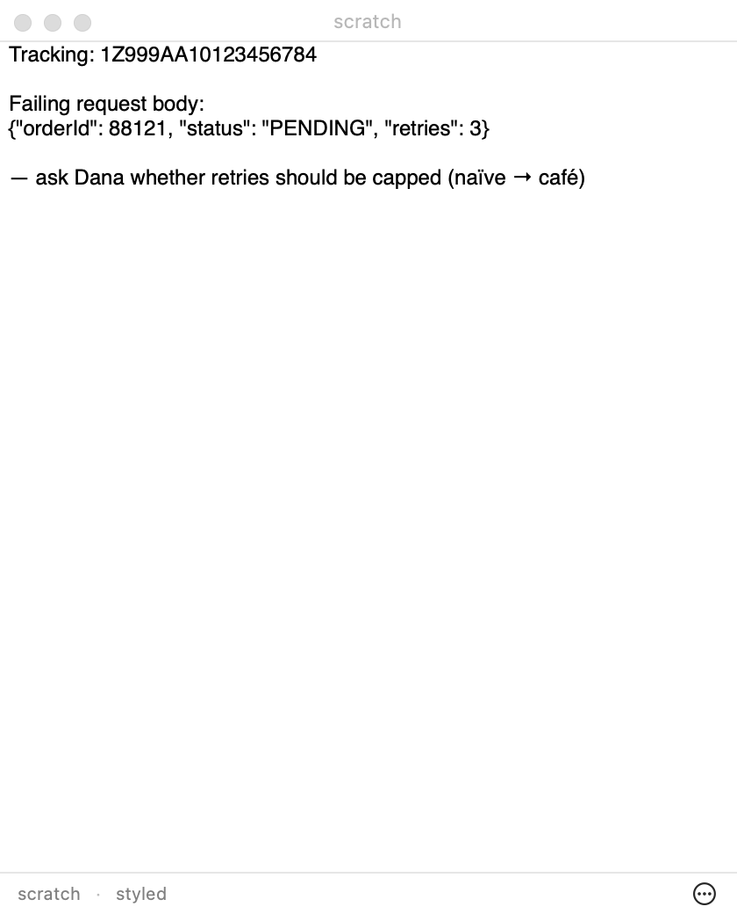
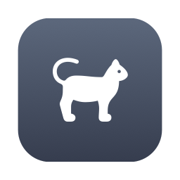
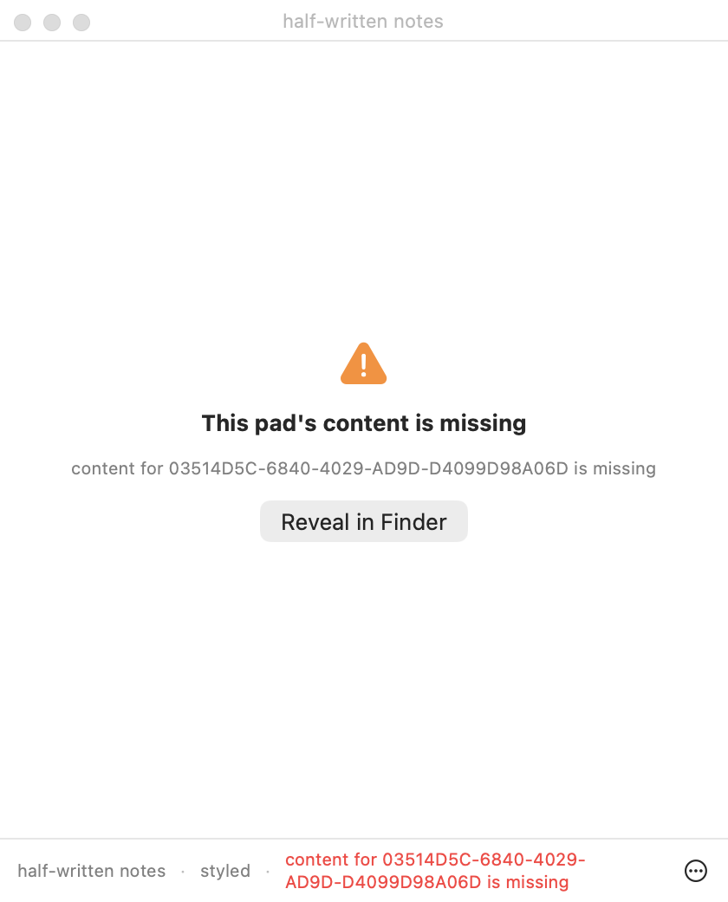

# Itchy

A menubar scratchpad for macOS. A small fixed set of pads, each a floating
window you can summon over whatever you are working in, type or paste into, and
close without being asked to name or file anything. Content stays until you
remove it.

The differentiating idea is that pads are eventually addressable by software
agents over the Model Context Protocol — a surface both you and a coding agent
can read from and write to. That arrives in a later release; see
[docs/itchy-vision.md](docs/itchy-vision.md) for why it is the point.

<p align="center">
  
</p>

A pad floats over other applications without bringing Itchy forward, and its
status line shows the pad's name and mode. The menubar item is a cat:

<p align="center">
  
  &nbsp;&nbsp;&nbsp;
  
</p>

A pad whose content cannot be read opens onto the fault rather than onto an
empty editor. That is deliberate: an empty editor over unreadable content would
destroy it on the next save.

<p align="center">
  
</p>

## Requirements

| | |
|---|---|
| macOS | 26 or later. There is no back-compatibility story and there will not be one |
| Xcode | 26 or later, for the toolchain and for `swift-format` |
| SwiftLint | `brew install swiftlint` |
| XcodeGen | `brew install xcodegen` |

`swift-format` comes from the Xcode toolchain and is invoked as
`xcrun swift-format`. Do not install it from Homebrew: a separately installed
formatter drifts from the compiler that builds the code.

## Building

```bash
git clone <repository> itchy && cd itchy
make open        # generates Itchy.xcodeproj and opens it in Xcode
```

`Itchy.xcodeproj` is generated from `project.yml` and is not committed. Files
you create on disk are picked up on the next generate; adding a file inside
Xcode does not add it to `project.yml`. See
[docs/decisions/D-12-xcode-project.md](docs/decisions/D-12-xcode-project.md).

```bash
make app         # build the application bundle
make test        # everything, with hard time limits
make gate        # the full sprint exit gate: lint, architecture, tests, coverage
make help        # every target
```

A warm `make test` takes about twenty seconds. If it takes minutes, something
is wrong — see Troubleshooting.

## Running the tests

```bash
make test        # packages, harness, app target — no permissions needed
make test-ui     # the XCUITest suite, which does need automation permission
make test-all    # both
make coverage    # coverage against the 80% floor; COVERAGE_REPORT=1 for per-file
make verify-gate # proves the gates fail when they should
```

`make test` deliberately skips the UI suite. It is the only part that needs
macOS automation permission, and a permission prompt blocks invisibly — the
symptom is a run that hangs rather than a question you can answer. Keeping it
out of the default path means the everyday loop never stops to ask.

No individual test should take more than ten seconds. One that does has not
found a slow path, it has hung, and the harness treats that as a failure. The
rules live in `Tests/ItchyTests/TestTiming.swift`.

## Layout

```
App/            application: menubar, panels, text bridge, settings
Packages/
  ItchyCore/    pad model, store, transforms. Links no UI framework, by construction
  ItchyServices/transforms, MCP server, model client
Harness/        itchyctl, a development-only command-line driver for the store
Shim/           itchy-mcp, the stdio proxy (arrives with the MCP server)
Scripts/        gates, coverage, release
docs/           vision, architecture, requirements, specification, plan, decisions
```

Pads are stored as flat files under
`~/Library/Application Support/Itchy/pads.noindex/`, one directory per pad,
holding `content.rtfd`, `content.txt` and `meta.json`. There is no database, and
everything is readable with `ls` and `cat`. The `.noindex` suffix keeps pad
contents out of Spotlight while leaving them readable to `grep` and to tooling —
see [docs/decisions/D-16-spotlight-exclusion.md](docs/decisions/D-16-spotlight-exclusion.md).

`itchyctl` drives the store without the interface, which is useful for looking
at what is actually on disk:

```bash
cd Harness && swift build
ITCHY_ROOT=/tmp/scratch .build/debug/itchyctl create "notes"
ITCHY_ROOT=/tmp/scratch .build/debug/itchyctl list
ITCHY_ROOT=/tmp/scratch .build/debug/itchyctl fault content   # damage a pad on purpose
```

### Repeated permission prompts

If macOS asks for automation permission every time you run the UI suite, run:

```bash
make sign-setup
make regenerate
```

An ad-hoc signed application has no stable designated requirement, so TCC keys
its grant on the code hash — and the hash changes on every build. Every rebuild
therefore looks like a different application, and the prompt comes back. Signing
Debug builds with a real identity gives a stable requirement:

```
designated => identifier "com.wdogsystems.itchy" and anchor apple generic
              and certificate leaf[subject.CN] = "Apple Development: …"
```

That is stable across rebuilds, so answering the prompt once is enough.

`make sign-setup` picks an unexpired identity from the keychain — preferring
Developer ID, then Apple Development — and writes
`Config/Signing.local.xcconfig`, which is not committed. Without an identity,
builds stay ad-hoc and everything still works except that the prompt returns.

## Shipping: certificates and notarisation

Itchy is distributed directly, signed with a Developer ID and notarised — not
through the App Store. The sandbox would complicate the loopback MCP server, the
Keychain-held token and any future local process invocation, and buys nothing
when distribution is direct.

Check what this machine can do:

```bash
make ship-check
```

It reports each requirement and what to do about it. Both items below need a
person; neither can be done from a build script.

### 1. A Developer ID Application certificate

Requires membership of the Apple Developer Program. A free account issues
*Apple Development* certificates, which cannot sign for direct distribution —
if `make ship-check` lists only those, this is the step that is missing.

The straightforward route is through Xcode:

1. **Xcode → Settings → Accounts**, and add the Apple ID if it is not there.
2. Select the team, then **Manage Certificates…**
3. **+** → **Developer ID Application**.
4. Confirm with `security find-identity -v -p codesigning`. The line should read
   `Developer ID Application: <name> (<team id>)`.

Through the portal instead, if you need the certificate on a machine other than
the one generating the request: create a Certificate Signing Request in
**Keychain Access → Certificate Assistant → Request a Certificate From a
Certificate Authority**, upload it at
**developer.apple.com → Certificates, Identifiers & Profiles → Certificates →
+ → Developer ID Application**, then download and double-click the result.

Keep the private key. A Developer ID certificate cannot be re-downloaded with
its key, and losing it means revoking and reissuing.

### 2. A notarytool credential profile

Notarisation authenticates with an app-specific password rather than your Apple
ID password.

1. At **appleid.apple.com → Sign-In and Security → App-Specific Passwords**,
   generate one and copy it.
2. Find the team identifier at
   **developer.apple.com → Membership details**, or in the parentheses of the
   `security find-identity` output above.
3. Store the credentials in the keychain, once:

```bash
xcrun notarytool store-credentials notarytool \
  --apple-id "you@example.com" \
  --team-id "ABCDE12345" \
  --password "abcd-efgh-ijkl-mnop"
```

The profile name `notarytool` is what the release script expects; override it
with `ITCHY_NOTARY_PROFILE` if you use another.

### 3. Releasing

```bash
make ship-check   # confirm both of the above
make release      # Developer ID signed, hardened runtime, verified
make notarise     # submit, wait, staple
make dmg          # package a signed disk image
```

The hardened runtime is required for notarisation and applies to Release builds
only — it blocks XCTest bundle injection, so Debug builds do not use it.

Verify the result on a machine that has never seen the build: it should open
from Finder without a Gatekeeper override. That check is on the manual list
because it cannot be made from the machine that produced the build.

## Troubleshooting

**`make test` takes minutes.** Something is forcing a full rebuild. The usual
cause is `Itchy.xcodeproj` being regenerated on every invocation; it is a file
target that should only regenerate when `project.yml` changes. `make regenerate`
forces one deliberately.

**A test run never finishes.** Two causes, in order of likelihood.

A permission dialog is waiting on screen. It blocks the test runner and is easy
to miss on a second display. `make sign-setup` stops it recurring; to check
whether one is up right now:

```bash
osascript -e 'tell application "System Events" to get name of every process whose frontmost is true'
```

Or an Itchy instance was left behind by an interrupted run — `XCUIApplication`
expects to own the process it launches. `Scripts/test.sh` kills strays before
starting; by hand:

```bash
pkill -f "Itchy.app/Contents/MacOS/Itchy"
```

**The global hotkey does nothing.** Another application probably holds the
combination; Settings says so under the recorder. Itchy needs no Accessibility
permission for the hotkey and will never ask for one.

**A login item appears pointing at a build directory.** It should not: Itchy
only registers itself automatically when running from `/Applications`. If an
older build left one, remove it in **System Settings → General → Login Items**.

## Documentation

| | |
|---|---|
| [Vision](docs/itchy-vision.md) | Why this exists, and what it must never become |
| [Architecture](docs/itchy-architecture.md) | Layers, storage, build order |
| [Architecture diagram](docs/itchy-architecture-diagram.html) | The system in one view, including external collaborators |
| [Requirements](docs/itchy-requirements.md) | Numbered, with acceptance criteria |
| [Specification](docs/itchy-specification.md) | How it is assembled; decisions D-1…D-11 |
| [Implementation plan](docs/itchy-implementation-plan.md) | Sprints and the exit gate |
| [Decisions](docs/decisions/) | The log, including everything decided since |

Itchy is for transient content. Before adding anything, the question is whether
the feature serves content that is passing through or content that has earned a
place — and if the latter, the answer is no.
